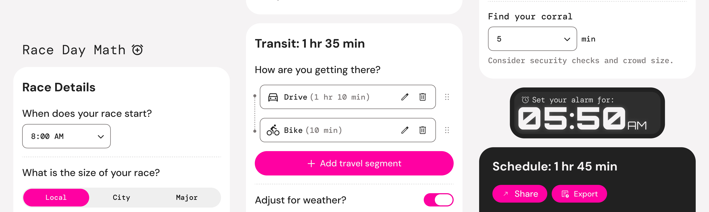

# Race Day Math 🏃‍♂️⏱️

**Race Day Math** is a precision utility for competitive runners designed to eliminate "race-morning brain fog." Instead of manually calculating when to wake up based on transit times, bathroom lineups, and corral closures, this app reverse-engineers your entire morning from the moment the starter pistol goes off.

🔗 **[Try it live →](https://race-day-math.vercel.app)**

---

### 🏁 Key Features
- **Reverse-Engineered Scheduling:** Set your race start time and work backward through every pre-race milestone.
- **Smart Logic:** Custom time-utility engine that handles AM/PM transitions and duration calculations seamlessly.
- **Shareable Itinerary:** One-tap export to share your schedule with support crews or running partners via formatted text or a Markdown table.
- **Mobile-First Design:** Fully optimized responsive interface with a sticky alarm widget and bottom-sheet modals.
- **Precise Milestones:** Pre-set buffers for common race hurdles like gear check, bathroom lines, and warm-up.
- **Multi-Leg Transit:** Add and reorder multiple travel segments (drive, bike, shuttle, ferry, and more) with drag-and-drop.

---

### ✏️ Design Process
- **The Problem:** Runners often face "race-morning brain fog" - a combination of peak performance anxiety and extreme sleep deprivation (often waking up at 3:00 AM). Calculating the "time to leave" based on a 7:15 AM start, while accounting for a 20-minute shuttle, 45-minute bag drop, and 30-minute warm-up, is a recipe for error. This project exists to shift that cognitive load from the runner to a reliable, technical system.
- **The Solution:**
  - *Anticipatory Logic:* Built the UX around a "Reverse-Chronology" flow. You input your race start time and the app works backward through every step of your morning.
  - *Progressive Disclosure:* To keep the UI clean, toggles reveal only the fields that are relevant — optional steps like snooze, breakfast, and weather buffer stay hidden until needed.

---

### 🛠 Tech Stack
- **Framework:** React 18
- **Build Tool:** Vite
- **Styling:** Tailwind CSS + CSS custom properties, inline styles
- **State Management:** Custom React hook (`use-form-data`)
- **Deployment:** Vercel (CI/CD)

---

### 🚀 Getting Started

1. **Clone the repo:**
   ```bash
   git clone https://github.com/adfinley/race-day-math.git
   ```

2. **Install dependencies:**
   ```bash
   npm install
   ```

3. **Run locally:**
   ```bash
   npm run dev
   ```

4. **Lint:**
   ```bash
   npm run lint
   ```
